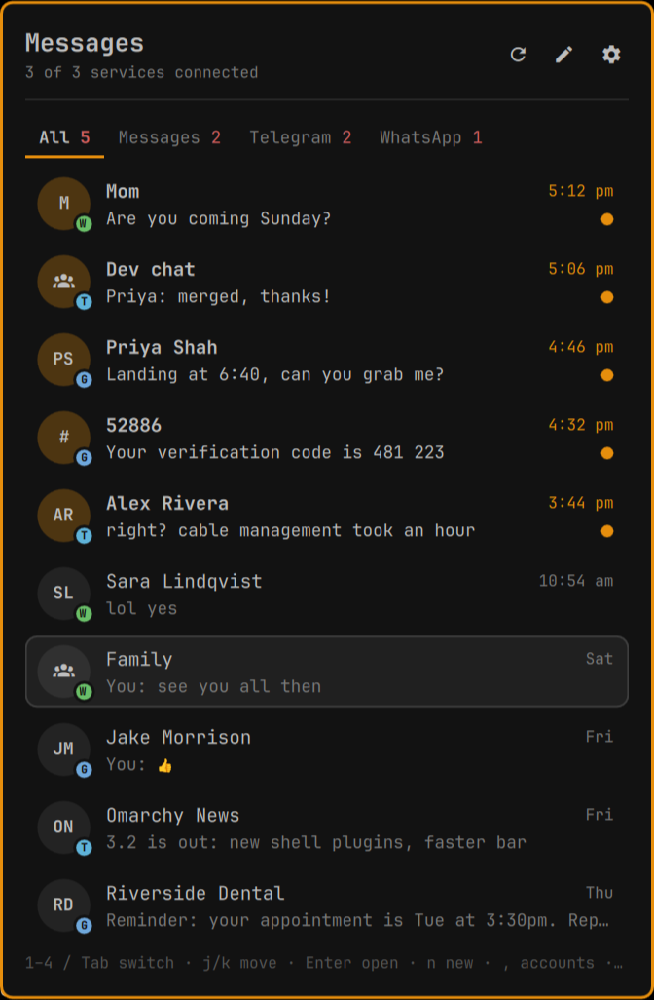
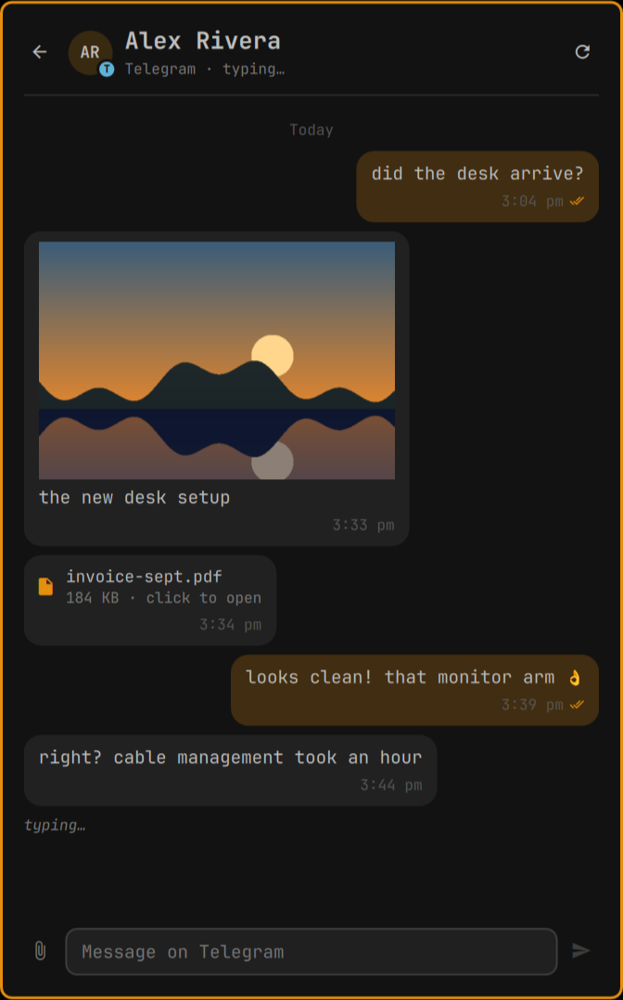
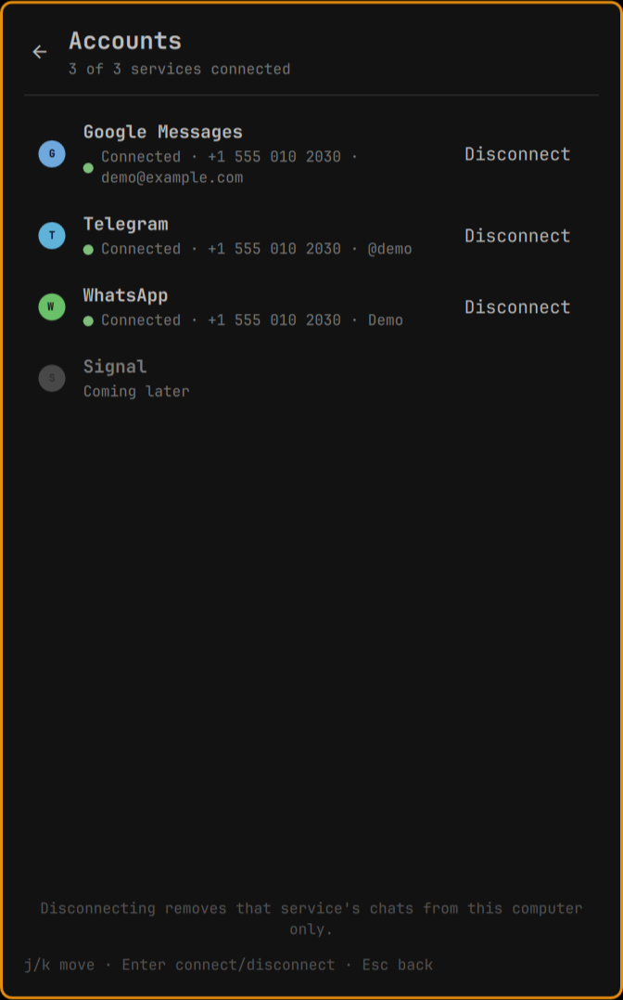
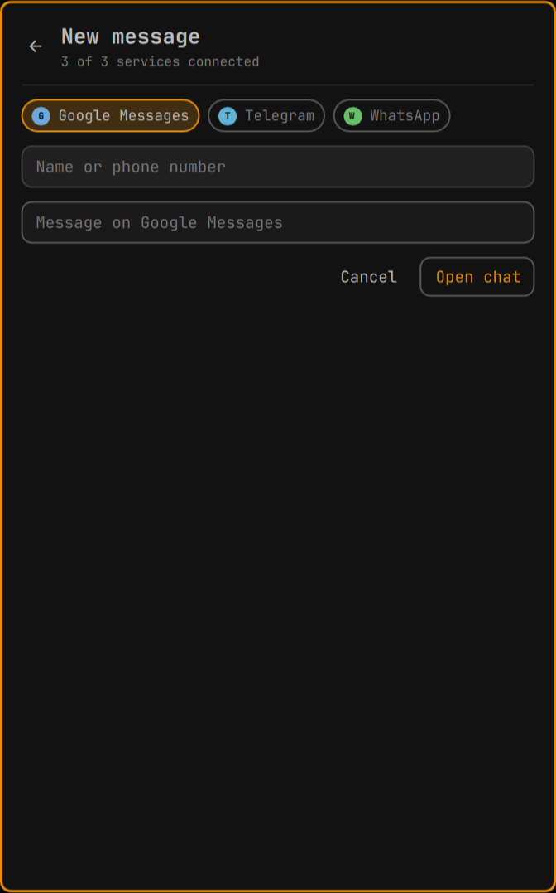

# Omarchy Messages

Google Messages, Telegram and WhatsApp in one Omarchy bar icon.

One icon with a combined unread badge. One panel with a merged inbox, a tab per
service, threads with a reply box, a new-message screen, and desktop
notifications named after the service. On Telegram you can also send photos and
files. Links in messages are clickable, and received photos, videos and files
open with one click.

If you used the older Google Messages-only plugin (gmessages), this one can
take over its pairing; see [Coming from the gmessages plugin](#coming-from-the-gmessages-plugin).

## Screenshots

All chats in one list, with a tab per service. The service marks (G, T, W)
show where each chat lives. Made-up demo data.

<p>




</p>

## How it works

A Go daemon (`bin/omamessagesd`) runs each service as a *provider* and mirrors
everything into `~/.local/state/omarchy/omamessages/`. The QML panel only
watches those files and runs `omamessagesd <command>` when you do something.
The shell starts the daemon; a second one exits quietly.

| Service | Library | Connects as |
|---|---|---|
| Google Messages | [mautrix-gmessages' libgm](https://github.com/mautrix/gmessages) | Messages for Web, paired through your Google account |
| Telegram | [gotd/td](https://github.com/gotd/td) | a regular Telegram app, with your own API credentials |
| WhatsApp | [whatsmeow](https://github.com/tulir/whatsmeow) | a linked device of your phone, like WhatsApp Web |

A crash in one service marks that service as "error"; the daemon and the other
services carry on.

## Install

The daemon is built from source on your machine; nothing prebuilt is shipped.
You need Go 1.26+ (`omarchy pkg add go`, or `mise use -g go@latest`) and gcc
(WhatsApp's store is SQLite through cgo).

```bash
omarchy plugin add https://github.com/sabnanikl-dev/omamessages.git
cd ~/.config/omarchy/plugins/omamessages && ./build.sh
omarchy plugin enable omamessages --section right
```

The first build takes about a minute. After `omarchy plugin update
omamessages`, run `./build.sh` again; it restarts the daemon if it's
running.

Bind the panel in `~/.config/hypr/bindings.lua`, for example:

```lua
o.bind("SUPER + SHIFT + G", "Messages", "omarchy-shell omamessages toggle")
```

## Connecting services

Open the panel, press `,` (or the gear) for **Accounts**, and press **Connect**.
Each service asks for what it needs, one step at a time; `Esc` cancels.

### Google Messages

1. On the phone: Google Messages → profile picture → **Device pairing**, and
   turn on pairing with your Google account.
2. Be signed in at <https://messages.google.com/web> in a Chromium-family
   browser (Chromium, Chrome, Brave, Vivaldi, Edge).
3. **Connect**: the daemon reads that browser's Google session and shows an
   emoji. Tap the same emoji on the phone.

If no browser session is found, the panel asks you to paste the cookies instead
(devtools → Network → right-click the first request → Copy as cURL). They're
stored only in `gmessages/session.json` (0600).

To check the browser side without touching the phone:

```bash
bin/omamessagesd gmessages-cookies --check
```

The phone has to stay online, as with Messages for Web. When Google expires the
sign-in, the daemon picks up a fresh one from the browser by itself.

### Telegram

Telegram needs your own API credentials, once:

1. Sign in at <https://my.telegram.org> → **API development tools**, and
   create an app (any name).
2. Either set `OMAMESSAGES_TELEGRAM_API_ID` and `OMAMESSAGES_TELEGRAM_API_HASH`
   in the environment the shell runs in, or enter them at the first connect
   step as `api_id api_hash`. The panel saves them to `telegram/app.json` (0600);
   the environment wins if both exist.
3. Enter your phone number, then the code Telegram sends to your Telegram app,
   then your cloud password if you use two-step verification. Or choose
   **QR code** and scan it from the phone (Settings → Devices → Link Desktop
   Device).

This computer shows up in Telegram's active sessions as **Omarchy**.

### WhatsApp

1. **Connect** shows a QR code, refreshed about every 20 s.
2. On the phone: WhatsApp → Settings → **Linked devices** → Link a device, and
   scan it. Or choose **phone number** and type the 8-character code the panel
   shows into WhatsApp on the phone.

This computer shows up under Linked devices as **Omarchy**. WhatsApp sends your
existing chats **once**, right after linking (the newest 300 messages per chat
are kept); after that, only new messages arrive. The phone has to come online
at least every 14 days, or WhatsApp unlinks this computer. If WhatsApp asks for
a passkey while linking, use the phone-number method instead.

## Using it

| Action | Mouse | Keyboard |
|---|---|---|
| Open / close the panel | click the icon | `omarchy-shell omamessages toggle` |
| Refresh | right-click the icon | `r` |
| New message | middle-click the icon, or ✎ | `n` |
| Switch tab (All, then one per connected service) | click the tab | `1`–`4`, `Tab` / `Shift+Tab` |
| Move / open a conversation | click a row | `j` `k` / `Enter` |
| Back | ← | `Esc` |
| Accounts | ⚙ | `,` |
| Send | ➤ | `Enter` in the reply box |
| Scroll a thread | wheel | `↑` `↓` in the reply box |
| Copy | drag over text (copies on release), or right-click a bubble for the whole message | `Ctrl+C` with text highlighted |
| Open a link | click it | |
| Photo | first click shows it in full in the chat, second opens the viewer | |
| Video, voice note, file | click to open | |

On Telegram, also:

| Action | How |
|---|---|
| Attach files | 📎 (the desktop file chooser) |
| Attach a screenshot | `Ctrl+V` in the reply box with an image on the clipboard |
| Attach from the file manager | drag the file onto the **bar icon**; the panel reopens on the chat |
| Caption | whatever you type goes with the files; several photos go as one album |

Opening a chat marks it read on the phone too. The thread stays where you are
reading; it only follows new messages while you're at the bottom.

**Typing indicators** work both ways on Telegram and WhatsApp. On WhatsApp, this
computer shows as *online* only while you're in a WhatsApp chat in the panel,
and goes offline 90 s after your last activity: while a linked device is
online, WhatsApp doesn't send notifications to your phone.

### IPC

```
omarchy-shell omamessages toggle|open|close|refresh|compose|accounts|status|unread
omarchy-shell omamessages tab <all|gmessages|telegram|whatsapp>
omarchy-shell omamessages openConversation <service>:<id>
omarchy-shell omamessages connectService <gmessages|telegram|whatsapp>
```

### CLI

Everything the panel does is available from a terminal; run `bin/omamessagesd`
for the full list. Conversation IDs are `<service>:<id>`, as listed in
`state.json`'s `conversations`.

```
bin/omamessagesd status
bin/omamessagesd send telegram:123456789 Running late, be there in 10
bin/omamessagesd send telegram:123456789 --file ~/Pictures/a.png --file ~/b.pdf Here you go
bin/omamessagesd new whatsapp +15551234567 Hi from Omarchy
bin/omamessagesd contacts gmessages ada
bin/omamessagesd connect whatsapp
```

## Settings

On the plugin's entry in `~/.config/omarchy/shell.json` (plugin settings are
read-only while the shell runs; restart it after a change).

| Key | Default | Meaning |
|---|---|---|
| `notifications` | `true` | a desktop notification for each incoming message (muted chats stay quiet) |
| `showPreview` | `true` | the last message under each name in the list |
| `providers` | `gmessages,telegram,whatsapp` | the services to run |
| `preview` | `""` | services to show read-only from the older gmessages plugin (`gmessages`) |

The panel remembers its last tab in `ui.json`.

## Files

```
~/.local/state/omarchy/omamessages/
  state.json                  every service merged: what the panel shows
  ui.json                     the panel's last tab
  daemon.log                  daemon output
  <service>/state.json        that service's chat list, so a restart isn't blank
  <service>/messages/<id>.json  each chat's cached thread
  gmessages/session.json      Google pairing and cookies (0600)
  telegram/app.json           your Telegram API credentials (0600)
  telegram/session.json       Telegram session (0600)
  whatsapp/store.db           WhatsApp keys and contacts (0600)

~/.cache/omarchy/omamessages/
  <service>/media/<chat>/     previews, and files you've opened
  outbox/                     pasted screenshots waiting to be sent (cleared after 7 days)
```

**Disconnect** in Accounts signs that service out and deletes its session, its
chats and its media from this computer. Nothing is sent anywhere except to the
services themselves.

## Coming from the gmessages plugin

If the older Google Messages-only plugin is installed and paired, disable it
first (`omarchy plugin disable <its id>`), then start this one with
`gmessages` in `providers`. On its first start the daemon copies the pairing
and cached chats from `~/.local/state/omarchy/gmessages/` (a copy; the old
folder isn't changed). While the old plugin's daemon is still running, this one
shows Google Messages read-only instead, so two clients never share one
pairing.

## Remove

1. In Accounts, **Disconnect** each service you connected. That signs this
   computer out (unlinks WhatsApp, logs out of Telegram and Google Messages)
   and deletes its sessions and chats.
2. Remove the plugin and what it kept:

```bash
omarchy plugin remove omamessages
rm -rf ~/.local/state/omarchy/omamessages ~/.cache/omarchy/omamessages
```

Take out any key binding you added for it.

## Limitations

- Sending photos and files works on Telegram only. Google Messages and WhatsApp
  send text.
- One account per service. No message search. Signal isn't supported.
- WhatsApp history comes only from the one-time sync at linking.
- Only chats in Google Messages' inbox (not archived) and Telegram's main list
  (not the Archive folder) are shown.
- A WhatsApp photo or file opens only while WhatsApp still stores it (usually
  a few weeks); older ones say so and have to be opened on the phone.

## Troubleshooting

- `daemon.log` in the state folder has the daemon's side; the shell's log is
  `quickshell log $(ls -t /run/user/1000/quickshell/by-id/*/log.qslog | head -1)`.
- After changing the panel's QML or the settings, run `omarchy restart shell`.
- Google Messages stuck in "error" with a rejected sign-in: open
  <https://messages.google.com/web> in the browser once, then
  `bin/omamessagesd gmessages-cookies --check`.

## License

MIT. The daemon links mautrix-gmessages' libgm (AGPL-3.0), whatsmeow (MPL-2.0)
and gotd/td (MIT); their source is fetched by `go build`.
